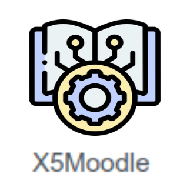
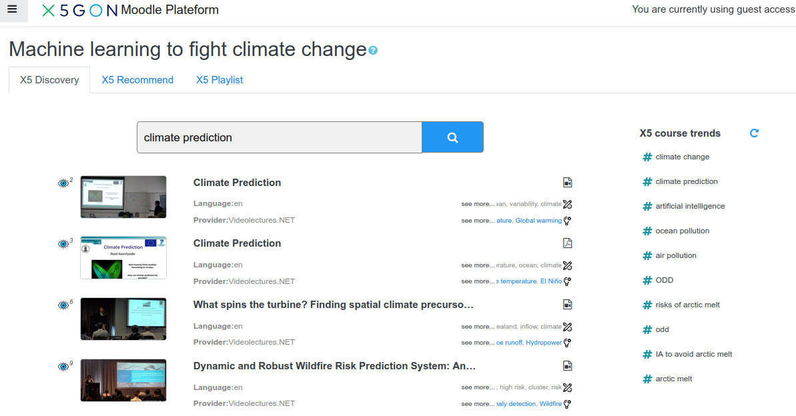
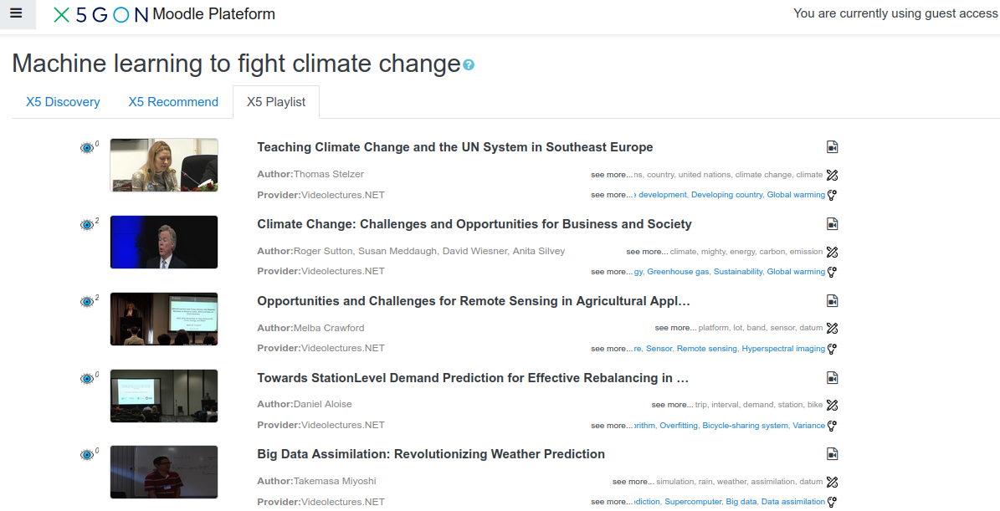
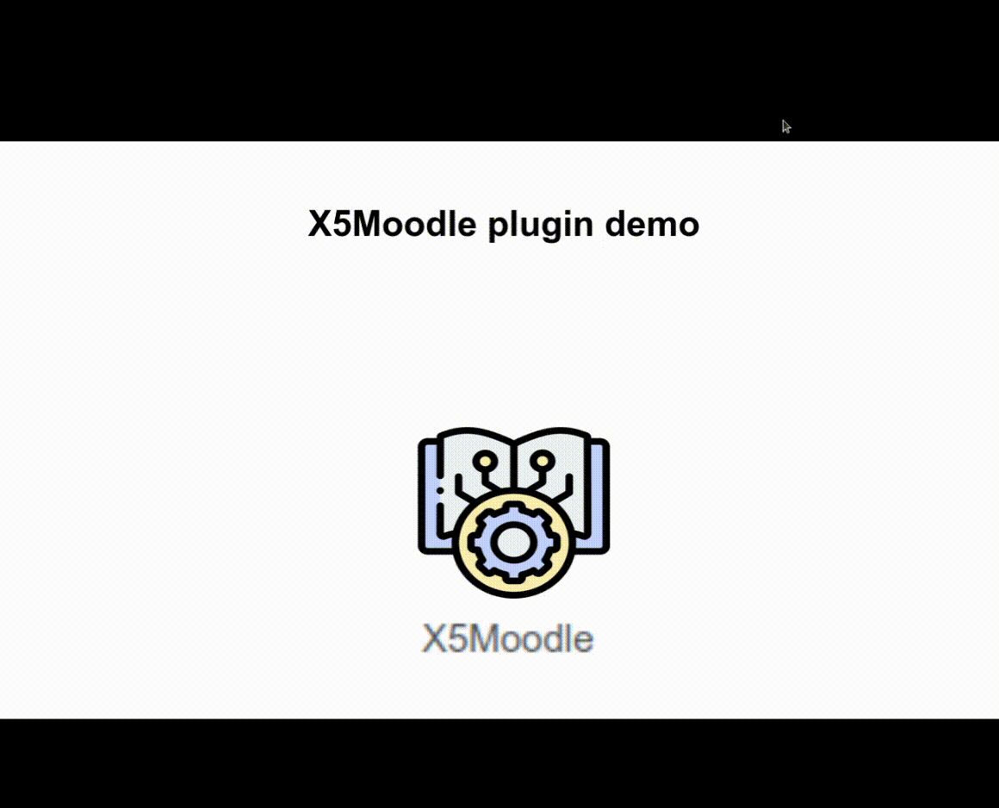

# X5Moodle

[![Contributors][contributors-shield]][contributors-url]
[![Forks][forks-shield]][forks-url]
[![Stargazers][stars-shield]][stars-url]
[![Issues][issues-shield]][issues-url]
[![License][license-shield]][license-url]


<!-- PROJECT LOGO -->
<p align="center">
  <a href="https://platform.x5gon.org">
    
  </a>
  <p align="center">
    <a href="https://www.x5gon.org/wp-content/uploads/2021/01/D2.5.pdf"><strong>Explore the full documentation »</strong></a>
    <br />
    <br />
    <a href="https://wp3.x5gon.org/moodle">View Demo</a>
    ·
    <a href="https://github.com/X5GON/x5moodle/issues">Report Bug</a>
    ·
    <a href="https://github.com/X5GON/x5moodle/issues">Request Feature</a>
  </p>
</p>


<!-- TABLE OF CONTENTS -->
<details open="open">
  <summary>Table of Contents</summary>
  <ol>
    <li>
      <a href="#about-the-project">About The Project</a>
      <ul>
        <li><a href="#built-with">Built With</a></li>
      </ul>
    </li>
    <li>
      <a href="#getting-started">Getting Started</a>
      <ul>
        <li><a href="#prerequisites">Prerequisites</a></li>
        <li><a href="#installation">Installation</a></li>
      </ul>
    </li>
    <li><a href="#usage">Usage</a></li>
    <li><a href="#demo">Demo</a></li>
    <li><a href="#roadmap">Roadmap</a></li>
    <li><a href="#contributing">Contributing</a></li>
    <li><a href="#license">License</a></li>
    <li>
      <a href="#contact">Contact</a>
      <ul>
        <li><a href="#members">Members</a></li>
        <li><a href="#moreupdates">More updates are on going !</a></li>
      </ul>
    </li>
  </ol>
</details>


<!-- ABOUT THE PROJECT -->
## About The Project



The X5GON project stands for easily implemented freely available innovative technology elements that will converge currently scattered Open Educational Resources (OER) available in various modalities across Europe and the globe.

X5GON's Learning Analytics Machine (LAM) is capable of dealing with multi-lingual collections of OER. We can give you insight into the usage of your resources across different languages, make your content seen across the world and see how your resources are being used in different cultures.

The  X5-Moodle  is  a  Moodle  activity plugin  implemented based  on  2  key  ideas:  1) providing AI-based smart tools for delivering open resources as a support during the course session, and 2) evolving the tools through the usage-based approaches rather than focusing on the user data. The aim of the plugin is to provide the teachers and students the best learning experience.Using the OER collection and the AI tools developed within X5GON, a new learning activity  is  designed  following  the  Moodle  specification  and  workflow,  as  well  as  the new-fashioned spirit of using AI to support learning.

### Built With

* [Moodle](https://moodle.org/)
* [Php](https://www.php.net/)
* [JQuery](https://jquery.com/)
* ...

<!-- GETTING STARTED -->
## Getting Started

To get a local copy up and running follow these simple example steps:
* Install a moodle version (tested with 3.5 and later).
* Install the X5Moodle activity plugin.
* Instanciate your X5Moodle activity.

Follow the instructions in the following sections:

### Prerequisites

Make sure you install the necessary environment requirements:
* Moodle
* Related dependencies of Moodle plugins (php, mysql, php-xmlrpc...)

### Installation
1. Clone the repository
    ```sh
    git clone https://github.com/X5GON/x5moodle
    ```
2. Remove the ".git" folder and compress in the Moodle format name, in order to be detected automatically by Moodle install wizard ("2021022301" is the last plugin version,must be the same as the one mentioned in the [version file](version.php)):
    ```sh
    rm -rf x5moodle/.git && mv x5moodle xfgon && zip -r mod_xfgon_moodle39_2021022301.zip xfgon
    ```
4. Install the resulting zip file on your Moodle installation using the Plugins Install Wizard of Moodle. All the needed information will be automatically detected by the wizard.

### Full documentation
X5Moodle is tested on Moodle 6/7/8  (recently tested and validated on 3.9 version)
A full documentation about the features and more detailed information can be found on the [X5Moodle 1.3 documentation](doc/X5MoodleV1.3.pdf)

<!-- USAGE EXAMPLES -->
## Usage

 Once enabled, from the administration board, the plugin will available as a new Moodle activity plugin type. So, you can add new X5Moodle activities whithin your courses.

Here is how it's looking the X5Moodle once installed, the [Official X5GON Moodle Installation](https://wp3.x5gon.org/moodle:
  * Visit this mockup course: [Climate change course](https://wp3.x5gon.org/moodle/course/view.php?id=2)
  * Choose to login as "guest" to be able to access the student view of the course.
  * Visit the X5moodle activity: ["Machine learning to fight climate change"](https://wp3.x5gon.org/moodle/mod/xfgon/discovery.php?id=4) .

Some examples of functionnalities:

The X5Discovery:



The X5Playlist:



<!-- DEMO -->
## Demo

<a href="https://mediaserver.univ-nantes.fr/videos/x5-moodle-ve/">

</a>


<!-- ROADMAP -->
## Roadmap

See the [open issues](https://github.com/X5GON/x5moodle/issues) for a list of proposed features (and known issues).

<!-- CONTRIBUTING -->
## Contributing

Contributions are what make the open source community such an amazing place to be learn, inspire, and create. Any contributions you make are **greatly appreciated**.

1. Fork the Project
2. Create your Feature Branch (`git checkout -b feature/AmazingFeature`)
3. Commit your Changes (`git commit -m 'Add some AmazingFeature'`)
4. Push to the Branch (`git push origin feature/AmazingFeature`)
5. Open a Pull Request

<!-- LICENSE -->
## License

Distributed under the [BSD-2-Clause](https://opensource.org/licenses/BSD-2-Clause) License. See [LICENSE](LICENSE) for more information.

<!-- CONTACT -->
## Contact

### Members
* Victor Connes - <victor.connes@gmail.com>
* Walid Ben Romdhane - [@walidbrw](https://github.com/walidbrw) - <walid_benromdhane@hotmail.fr>
* Colin de la Higuera - <cdlh@univ-nantes.fr>


### More updates are on going !
The work on X5Moodle is continuing :

More updated version can be found on [X5GON X5Moodle repository of the X5GON-University of Nantes team](https://gitlab.univ-nantes.fr/x5gon/x5moodle)

More updates can be found on:
* https://chaireunescorel.ls2n.fr/
* https://www.univ-nantes.fr/

<!-- MARKDOWN LINKS & IMAGES -->
[contributors-shield]: https://img.shields.io/github/contributors/X5GON/x5moodle.svg?style=for-the-badge
[contributors-url]: https://github.com/X5GON/x5moodle/graphs/contributors
[forks-shield]: https://img.shields.io/github/forks/X5GON/x5moodle.svg?style=for-the-badge
[forks-url]: https://github.com/X5GON/x5moodle/network/members
[stars-shield]: https://img.shields.io/github/stars/X5GON/x5moodle.svg?style=for-the-badge
[stars-url]: https://github.com/X5GON/x5moodle/stargazers
[issues-shield]: https://img.shields.io/github/issues/X5GON/x5moodle.svg?style=for-the-badge
[issues-url]: https://github.com/X5GON/x5moodle/issues
[license-shield]: https://img.shields.io/github/license/X5GON/x5moodle.svg?style=for-the-badge
[license-url]: https://github.com/X5GON/x5moodle/blob/master/LICENSE
[license]: https://img.shields.io/badge/License-BSD%202--Clause-green.svg
[license-link]: https://opensource.org/licenses/BSD-2-Clause


[project-screenshot]: readme/x5moodle.png
[x5discovery]: readme/x5discovery.png
[x5playlist]: readme/x5playlist.png
[x5moodle_demo]: readme/x5moodle_demo.gif
